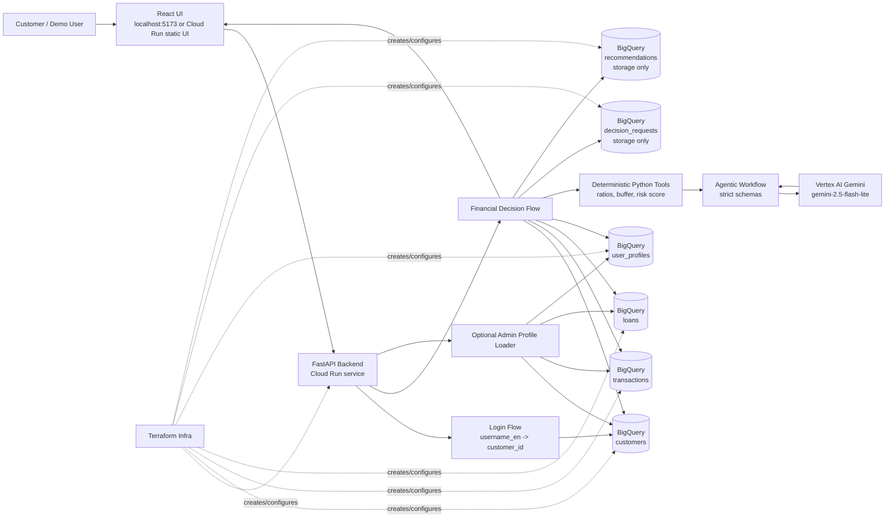
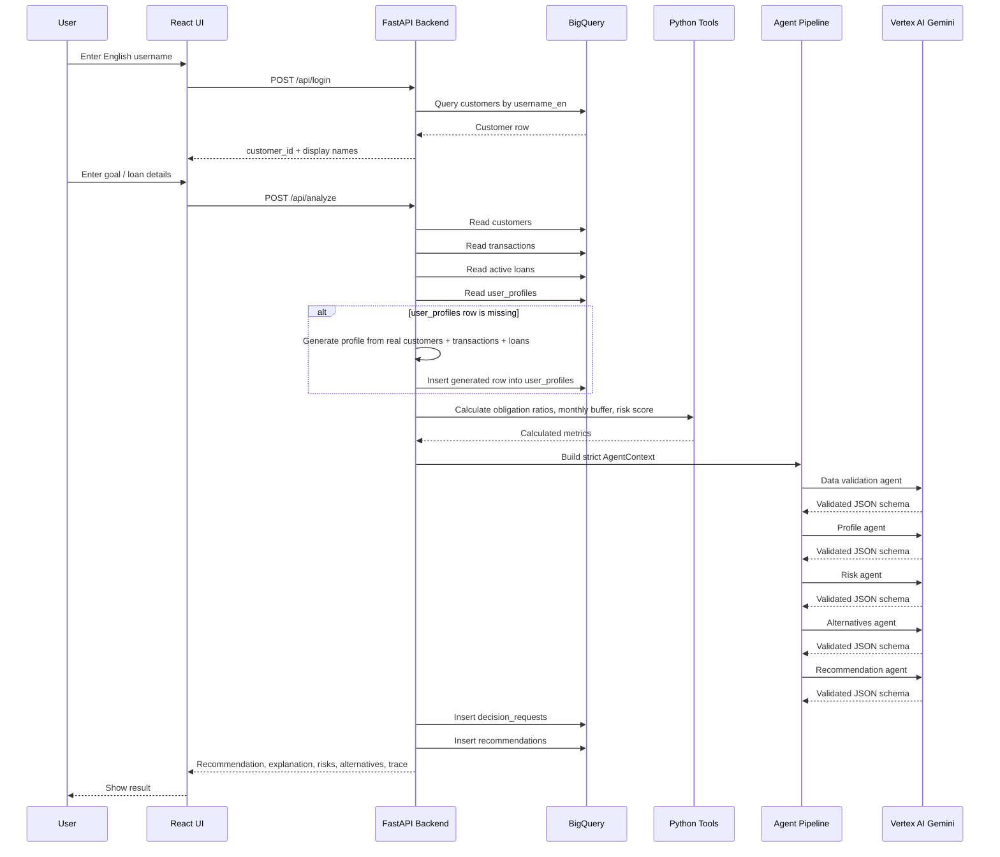
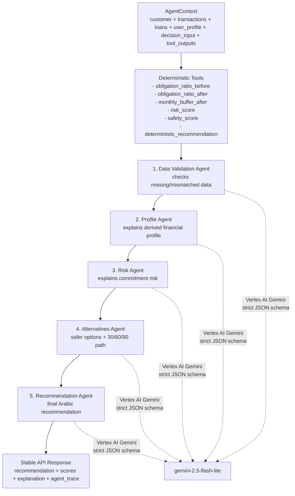
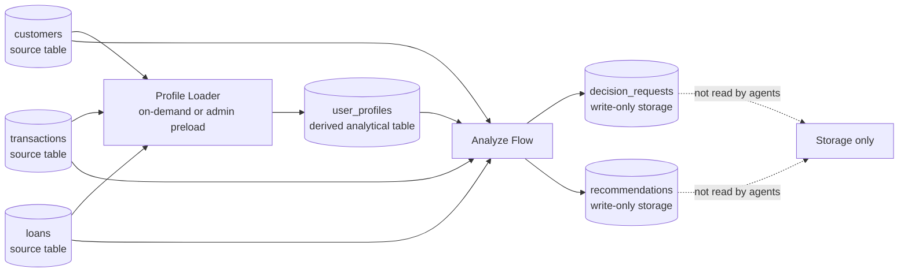

# Edraak Architecture Design

This document shows the production-style architecture for Edraak: a Cloud Run FastAPI + React app that retrieves real BigQuery banking data, generates a derived customer profile when needed, runs an agentic financial decision workflow through Vertex AI Gemini, and stores the request/recommendation outputs.

## 1. System Architecture



## 2. User Workflow



## 3. Agentic Workflow



## 4. BigQuery Table Usage



## 5. Service Responsibilities

| Area | Responsibility |
| --- | --- |
| React UI | Login screen, goal/loan form, loading states, result view, agent trace display |
| FastAPI Backend | API routes, BigQuery retrieval, on-demand profile generation, agent orchestration, response shaping |
| BigQuery Source Tables | `customers`, `transactions`, `loans` contain original banking data |
| BigQuery Derived Table | `user_profiles` is calculated from source tables and reused by analysis |
| BigQuery Storage Tables | `decision_requests` and `recommendations` store outputs only; they are not analysis inputs |
| Python Tools | Deterministic calculations that Gemini is not allowed to invent or change |
| Agents | Structured reasoning and Arabic explanations using strict Pydantic schemas |
| Vertex AI Gemini | LLM execution using `gemini-2.5-flash-lite` through Vertex AI only |
| Terraform | Infra setup for Cloud Run, BigQuery, IAM, and deployment configuration |

## 6. Runtime Log Timeline

The backend logs are designed to read like the workflow:

```text
flow.login.submitted
flow.login.success
flow.analysis.clicked
flow.analysis.data_collection.start
flow.analysis.data_collection.customer
flow.analysis.data_collection.transactions
flow.analysis.data_collection.loans
flow.analysis.data_collection.profile
flow.analysis.profile_generate_on_demand.start
flow.analysis.profile_generate_on_demand.completed
flow.tools.start
flow.tools.completed
flow.agent.validation.start
flow.agent.validation.completed
flow.agent.profile.start
flow.agent.profile.completed
flow.agent.risk.start
flow.agent.risk.completed
flow.agent.alternatives.start
flow.agent.alternatives.completed
flow.agent.recommendation.start
flow.agent.recommendation.completed
flow.analysis.storage.start
flow.analysis.storage.completed
flow.analysis.completed
```

## 7. Production Rules

- The app uses BigQuery source data, not in-code mock data.
- `user_profiles` can be generated on demand, but only from real BigQuery `customers`, `transactions`, and `loans`.
- Gemini must run through Vertex AI using `gemini-2.5-flash-lite`.
- Gemini responses must pass strict Pydantic schema validation.
- Deterministic Python tools own numeric calculations.
- `decision_requests` and `recommendations` are storage-only tables and must not be reused as agent input.
