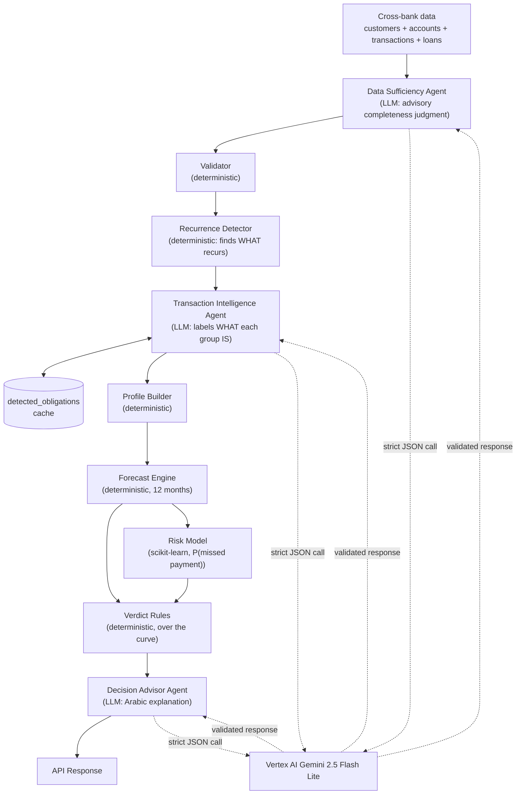
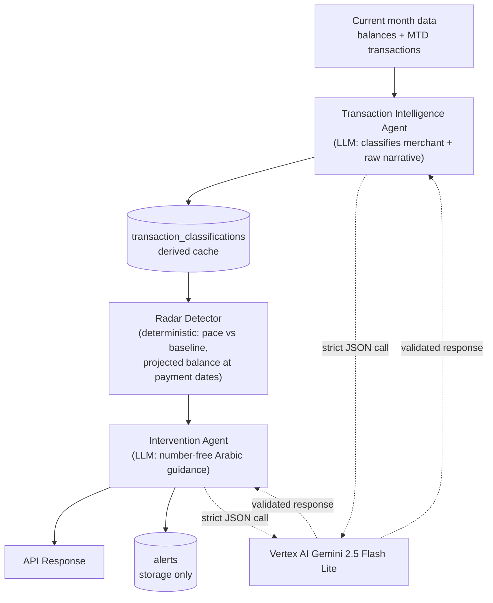

## 3. Agentic Workflow

Exactly four focused LLM agents remain after the reshape — each does work that
requires language judgment. Everything else is deterministic Python and is
shown in the trace as such (that is the auditability pitch, not a weakness).

Before Mode A begins, the **Data Sufficiency Agent** reviews deterministic
coverage evidence and warns when the linked accounts look like only part of the
customer's financial life. It is advisory: deterministic critical findings can
block analysis, while this agent can only warn.

### Mode A — Decision Seatbelt

### Mode B — Financial Radar

### Guardrails

- Strict Pydantic schema validation applies to every Gemini call. The three
  pipeline agents fail the request clearly on invalid output. The advisory Data
  Sufficiency Agent alone degrades to deterministic coverage with an explicit
  notice so it cannot lock the customer out.
- Deterministic Python groups the recurring transactions first (by consistent
  amount, day, and isolation/provider signal). The agent only *labels* each
  group, so it never sets an amount, day, or bank — the old amount-echo check
  is no longer needed because the LLM can't touch a number.
- Source transactions contain no category. The agent classifies spending from
  merchant, raw description, channel, and pattern evidence into a separate cache.
- Radar renders the balance equation and every numeric sentence in deterministic
  Python. The Intervention Agent can add guidance but is forbidden from writing
  numbers or dates.
- The Decision Advisor must echo the deterministic verdict exactly; the backend
  rejects the response if it differs.
- A number audit logs any figure in agent prose that does not exist in the
  agent's input payload.
