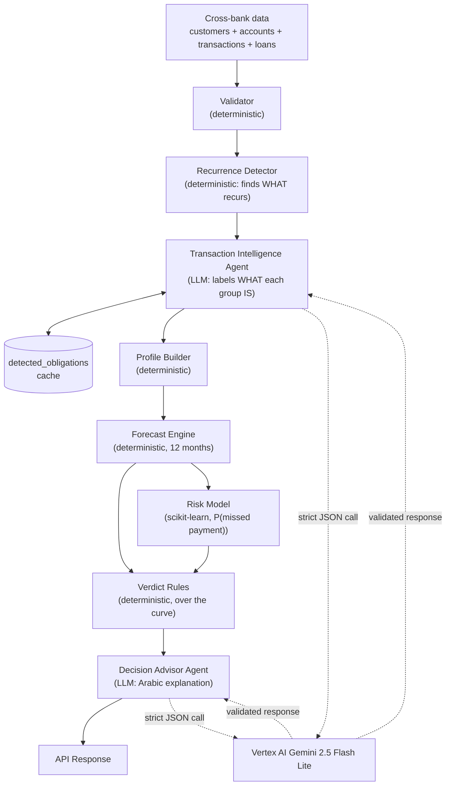
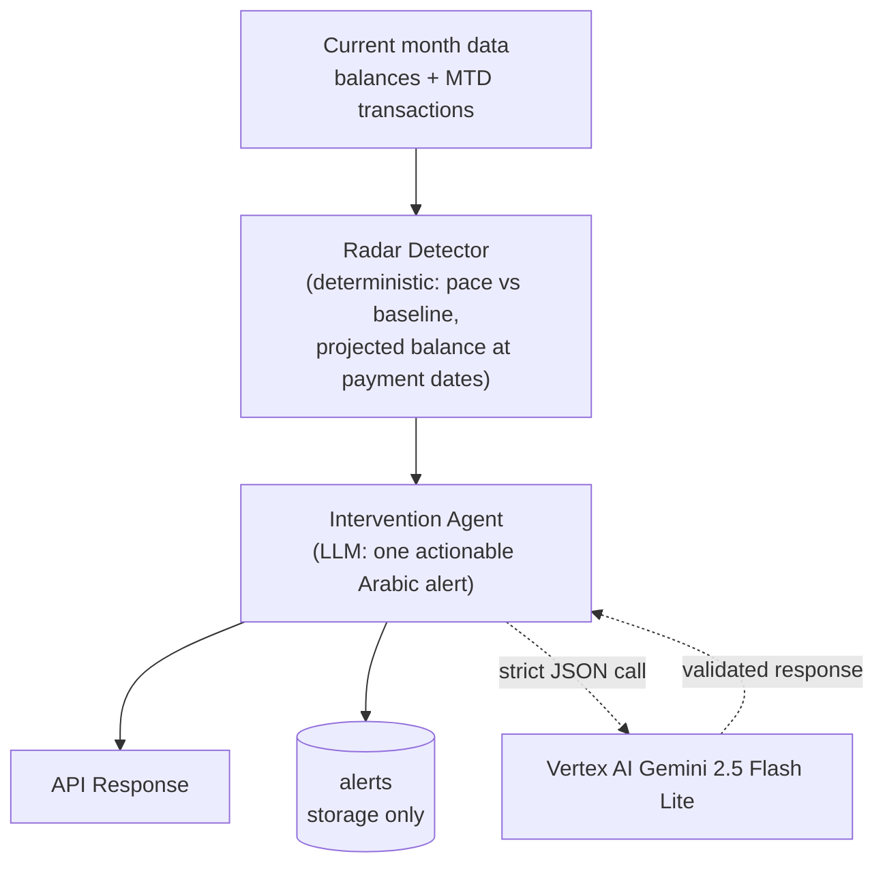

## 3. Agentic Workflow

Exactly three LLM agents remain after the reshape — each does work that
actually requires an LLM. Everything else is deterministic Python and is shown
in the trace as such (that is the auditability pitch, not a weakness).

### Mode A — Decision Seatbelt

### Mode B — Financial Radar

### Guardrails

- Strict Pydantic schema validation on every Gemini call; invalid output fails
  the request with a clear error — no silent degradation.
- Deterministic Python groups the recurring transactions first (by consistent
  amount, day, and isolation/provider signal). The agent only *labels* each
  group, so it never sets an amount, day, or bank — the old amount-echo check
  is no longer needed because the LLM can't touch a number.
- The Decision Advisor must echo the deterministic verdict exactly; the backend
  rejects the response if it differs.
- A number audit logs any figure in agent prose that does not exist in the
  agent's input payload.
