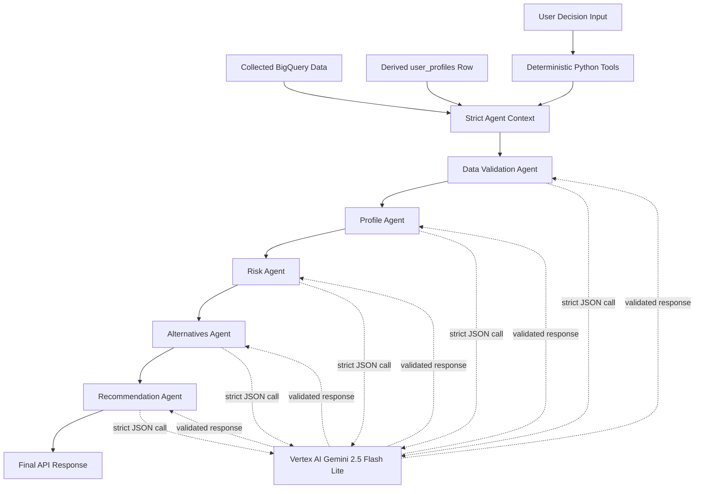

```mermaid
flowchart TD
    A[Collected BigQuery Data]
    B[Derived user_profiles Row]
    C[User Decision Input]
    D[Deterministic Python Tools]
    E[Strict Agent Context]

    F[Data Validation Agent]
    G[Profile Agent]
    H[Risk Agent]
    I[Alternatives Agent]
    J[Recommendation Agent]

    K[Final API Response]
    L[Vertex AI Gemini 2.5 Flash Lite]

    A --> E
    B --> E
    C --> D
    D --> E

    E --> F
    F --> G
    G --> H
    H --> I
    I --> J
    J --> K

    F -. strict JSON call .-> L
    G -. strict JSON call .-> L
    H -. strict JSON call .-> L
    I -. strict JSON call .-> L
    J -. strict JSON call .-> L

    L -. validated response .-> F
    L -. validated response .-> G
    L -. validated response .-> H
    L -. validated response .-> I
    L -. validated response .-> J
```