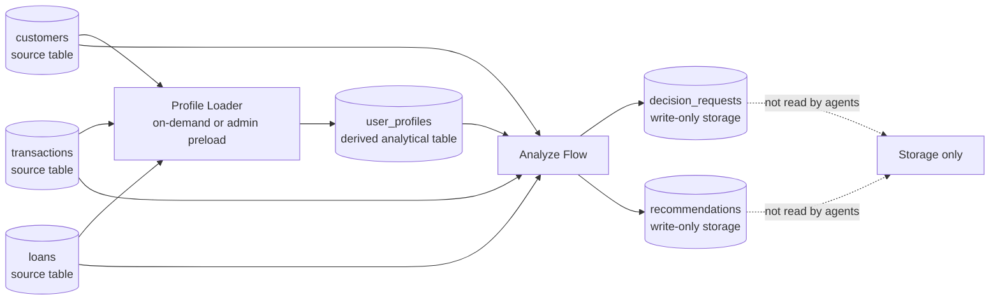

## 4. BigQuery Table Usage

```mermaid
flowchart LR
    Customers[("customers<br/>source table")]
    Transactions[("transactions<br/>source table")]
    Loans[("loans<br/>source table")]
    Profiles[("user_profiles<br/>derived analytical table")]
    Requests[("decision_requests<br/>write-only storage")]
    Recommendations[("recommendations<br/>write-only storage")]

    Customers --> ProfileLoader["Profile Loader<br/>on-demand or admin preload"]
    Transactions --> ProfileLoader
    Loans --> ProfileLoader
    ProfileLoader --> Profiles

    Customers --> Analysis["Analyze Flow"]
    Transactions --> Analysis
    Loans --> Analysis
    Profiles --> Analysis

    Analysis --> Requests
    Analysis --> Recommendations

    Requests -. "not read by agents" .-> StorageNote["Storage only"]
    Recommendations -. "not read by agents" .-> StorageNote
```
