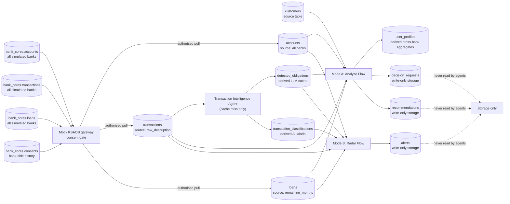

## 4. BigQuery Table Usage



### Seed data

Seed rows are generated by `app/data/seed/generate_seed_data.py` with dates
relative to the current day. On backend startup, `bank_cores.seed_meta` is
checked and stale data is refreshed automatically: the full world goes to
`bank_cores`, while only customers and their Alinma rows go to
`edraak_finance`. Manual loading is a recovery option:

```bash
cd cloud-run/edrak
GCP_PROJECT_ID=your-project python -m app.data.seed.load_seed_data
```

Demo customers:

- **fahad** — the hero: healthy inside Alinma (salary 16,500), but Al Rajhi holds
  the consolidated external demo picture: a personal loan with 2 installments left (2,200/mo), three
  BNPL stacks (Tabby 450, Tamara 380, Tabby 300), a monthly جمعية (1,000), and
  a family transfer (1,500). Mode A on a 2,500/mo car loan → الأفضل تأجيله with a
  computed ready-in month.
- **sara** — disciplined government professional: rent, modest car loan, and a
  large emergency fund → قرار آمن.
- **khalid** — the radar customer: salary on day 1, cafe spending accelerating
  this month, car installment 3,100 on day 27 → projected gap ≈ 340 SAR.
- **noura** — lower-income renter: personal loan plus overlapping BNPL/jamiya
  commitments and a minimal reserve → غير مناسب.
- **abdullah** — established family: strong cash reserves, but a mortgage,
  external car loan, nursery, family support, and jamiya create high fixed costs.

Neither source transactions table has a `category` field. Category meaning is
agent-derived from merchant, raw description, channel, and recurring evidence,
then stored only in `transaction_classifications`.
