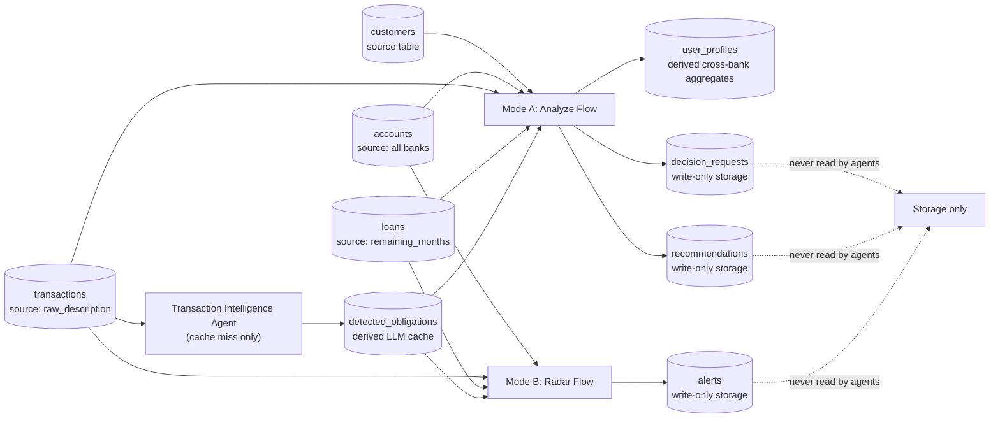

## 4. BigQuery Table Usage



### Seed data

Seed rows are generated by `app/data/seed/generate_seed_data.py` with dates
relative to the load day (that keeps the radar demo alive). Load with:

```bash
cd cloud-run/edrak
GCP_PROJECT_ID=your-project python -m app.data.seed.load_seed_data
```

Demo customers:

- **fahad** — the hero: healthy at Al Rajhi (salary 16,500), but across SNB and
  Riyad Bank: an SNB personal loan with 2 installments left (2,200/mo), three
  BNPL stacks (Tabby 450, Tamara 380, Tabby 300), a monthly جمعية (1,000), and
  a family transfer (1,500). Mode A on a 2,500/mo car loan → الأفضل تأجيله with a
  computed ready-in month.
- **sara** — comfortable: one car loan, no BNPL → قرار آمن.
- **khalid** — the radar customer: salary on day 1, cafe spending accelerating
  this month, car installment 3,100 on day 27 → projected gap ≈ 340 SAR.
- **noura** — overstretched: three BNPL stacks, thin savings → غير مناسب.
