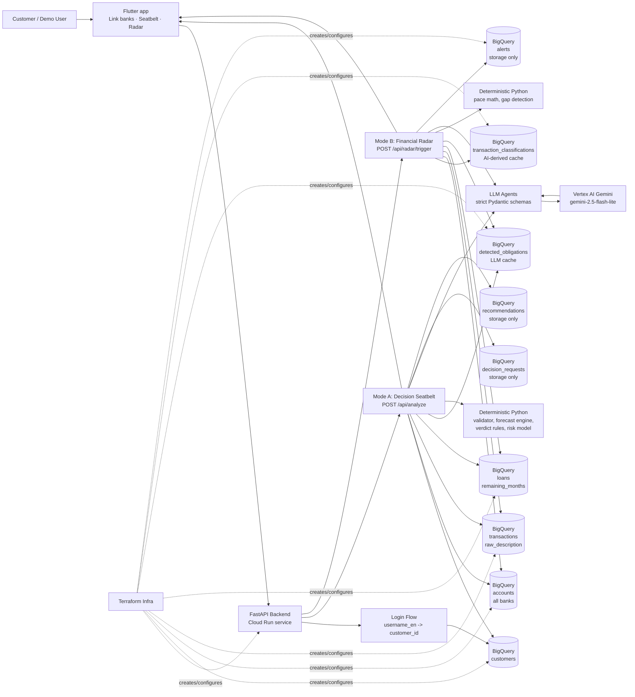
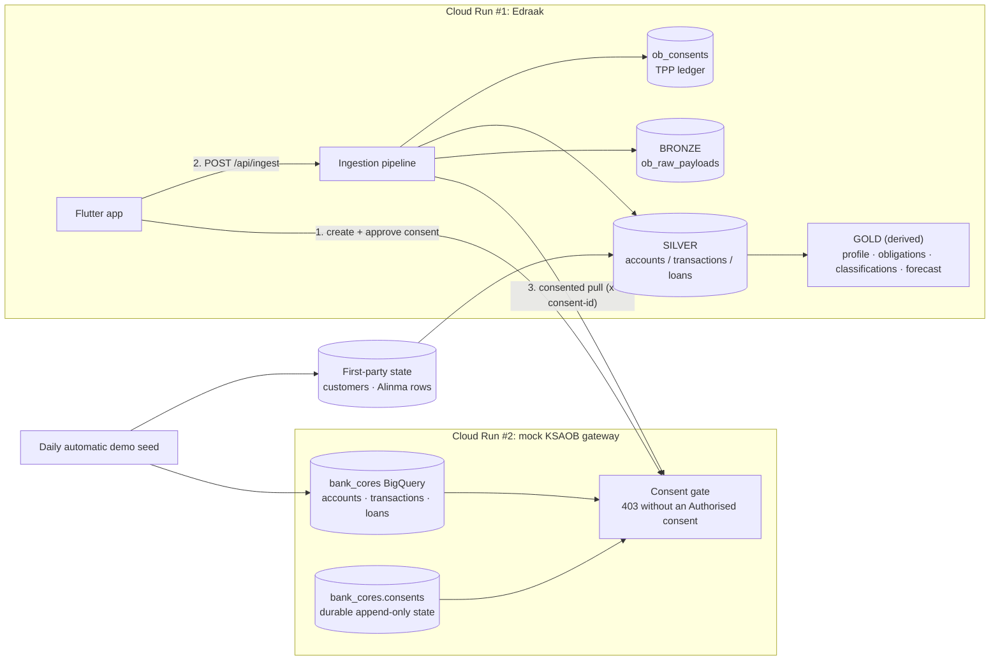

## 1. System Architecture

The principle: the LLM understands messy data and communicates; deterministic
Python computes every number. The LLM never invents or overrides a number.

## Open Banking retrieval — two services, one consent gate

Data from other banks only reaches the Edraak warehouse through a consented API
pull. The mock gateway is a separate Cloud Run service backed by the separate
`bank_cores` BigQuery dataset. For demo simplicity both services share one
runtime service account; separation here is by dataset and application path,
not a production-grade IAM boundary.

The startup seeder writes the full synthetic banking world to `bank_cores` and
only each customer's Alinma rows to `edraak_finance`. External accounts,
transactions, and loans are consolidated under Al Rajhi for the demo and arrive
through one consented gateway pull. The other bank choices remain visible but
have no seeded rows. Loans use a
demo-only product-data extension alongside the simulated AIS endpoints.

Source transactions intentionally contain no category. Transaction meaning is
derived from merchant, raw description, channel, and repeated patterns, then
stored separately in `transaction_classifications`.

Long-pressing the home-screen logo invokes the hidden reset flow: bank-side
consents are revoked, that customer's external warehouse rows and stored outputs
are deleted, and their generated Alinma-only rows are restored.
