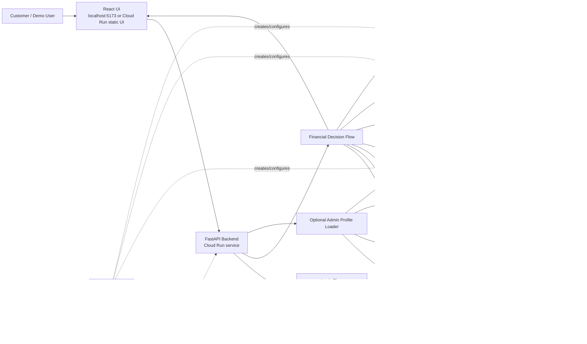

## 1. System Architecture

```mermaid
flowchart LR
    User["Customer / Demo User"] --> Browser["React UI<br/>localhost:5173 or Cloud Run static UI"]
    Browser --> API["FastAPI Backend<br/>Cloud Run service"]

    API --> AuthFlow["Login Flow<br/>username_en -> customer_id"]
    API --> AnalysisFlow["Financial Decision Flow"]
    API --> AdminFlow["Optional Admin Profile Loader"]

    AuthFlow --> BQCustomers[("BigQuery<br/>customers")]

    AnalysisFlow --> BQCustomers
    AnalysisFlow --> BQTransactions[("BigQuery<br/>transactions")]
    AnalysisFlow --> BQLoans[("BigQuery<br/>loans")]
    AnalysisFlow --> BQProfiles[("BigQuery<br/>user_profiles")]

    AdminFlow --> BQCustomers
    AdminFlow --> BQTransactions
    AdminFlow --> BQLoans
    AdminFlow --> BQProfiles

    AnalysisFlow --> Tools["Deterministic Python Tools<br/>ratios, buffer, risk score"]
    Tools --> Agents["Agentic Workflow<br/>strict schemas"]
    Agents --> Vertex["Vertex AI Gemini<br/>gemini-2.5-flash-lite"]
    Vertex --> Agents

    AnalysisFlow --> BQRequests[("BigQuery<br/>decision_requests<br/>storage only")]
    AnalysisFlow --> BQRecommendations[("BigQuery<br/>recommendations<br/>storage only")]
    AnalysisFlow --> Browser

    Terraform["Terraform Infra"] -. creates/configures .-> API
    Terraform -. creates/configures .-> BQCustomers
    Terraform -. creates/configures .-> BQTransactions
    Terraform -. creates/configures .-> BQLoans
    Terraform -. creates/configures .-> BQProfiles
    Terraform -. creates/configures .-> BQRequests
    Terraform -. creates/configures .-> BQRecommendations
```
