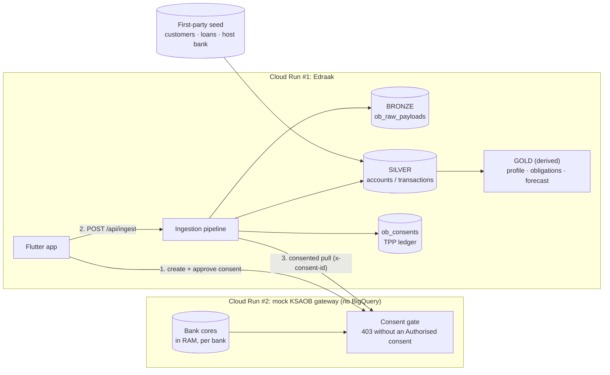

## 1. System Architecture

The principle: the LLM understands messy data and communicates; deterministic
Python computes every number. The LLM never invents or overrides a number.

## Open Banking retrieval — two services, one consent gate

Data from other banks only reaches the warehouse through a consented API pull.
The mock gateway is a **separate Cloud Run service** with no BigQuery access, so
the wall between "the banks" and "our warehouse" is physical, not narrative.

First-party data (the host bank, `customers`, `loans` as a bureau feed) is seeded
straight into BigQuery; every other bank stays in the gateway's RAM until the
customer links it. Loans arrive via the bureau feed (SIMAH-style), not AIS.
