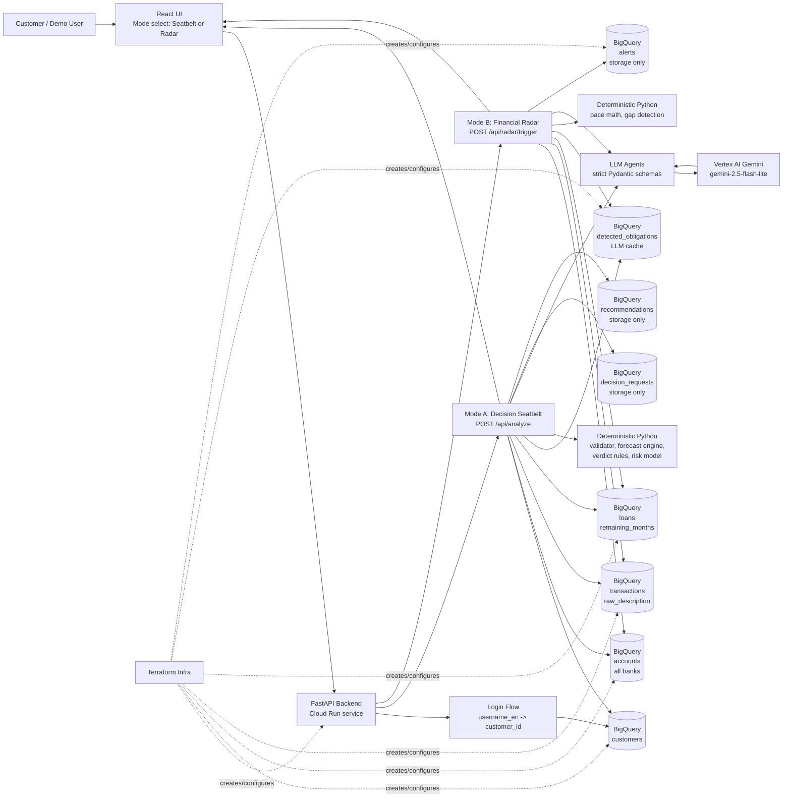

## 1. System Architecture

```mermaid
flowchart LR
    User["Customer / Demo User"] --> Browser["React UI<br/>Mode select: Seatbelt or Radar"]
    Browser --> API["FastAPI Backend<br/>Cloud Run service"]

    API --> AuthFlow["Login Flow<br/>username_en -> customer_id"]
    API --> AnalysisFlow["Mode A: Decision Seatbelt<br/>POST /api/analyze"]
    API --> RadarFlow["Mode B: Financial Radar<br/>POST /api/radar/trigger"]

    AuthFlow --> BQCustomers[("BigQuery<br/>customers")]

    AnalysisFlow --> BQCustomers
    AnalysisFlow --> BQAccounts[("BigQuery<br/>accounts<br/>all banks")]
    AnalysisFlow --> BQTransactions[("BigQuery<br/>transactions<br/>raw_description")]
    AnalysisFlow --> BQLoans[("BigQuery<br/>loans<br/>remaining_months")]
    AnalysisFlow --> BQObligations[("BigQuery<br/>detected_obligations<br/>LLM cache")]

    RadarFlow --> BQAccounts
    RadarFlow --> BQTransactions
    RadarFlow --> BQLoans
    RadarFlow --> BQObligations

    AnalysisFlow --> Deterministic["Deterministic Python<br/>validator, forecast engine,<br/>verdict rules, risk model"]
    RadarFlow --> RadarDet["Deterministic Python<br/>pace math, gap detection"]

    AnalysisFlow --> Agents["LLM Agents<br/>strict Pydantic schemas"]
    RadarFlow --> Agents
    Agents --> Vertex["Vertex AI Gemini<br/>gemini-2.5-flash-lite"]
    Vertex --> Agents

    AnalysisFlow --> BQRequests[("BigQuery<br/>decision_requests<br/>storage only")]
    AnalysisFlow --> BQRecommendations[("BigQuery<br/>recommendations<br/>storage only")]
    RadarFlow --> BQAlerts[("BigQuery<br/>alerts<br/>storage only")]

    AnalysisFlow --> Browser
    RadarFlow --> Browser

    Terraform["Terraform Infra"] -. creates/configures .-> API
    Terraform -. creates/configures .-> BQCustomers
    Terraform -. creates/configures .-> BQAccounts
    Terraform -. creates/configures .-> BQTransactions
    Terraform -. creates/configures .-> BQLoans
    Terraform -. creates/configures .-> BQObligations
    Terraform -. creates/configures .-> BQAlerts
```

The principle: the LLM understands messy data and communicates; deterministic
Python computes every number. The LLM never invents or overrides a number.
