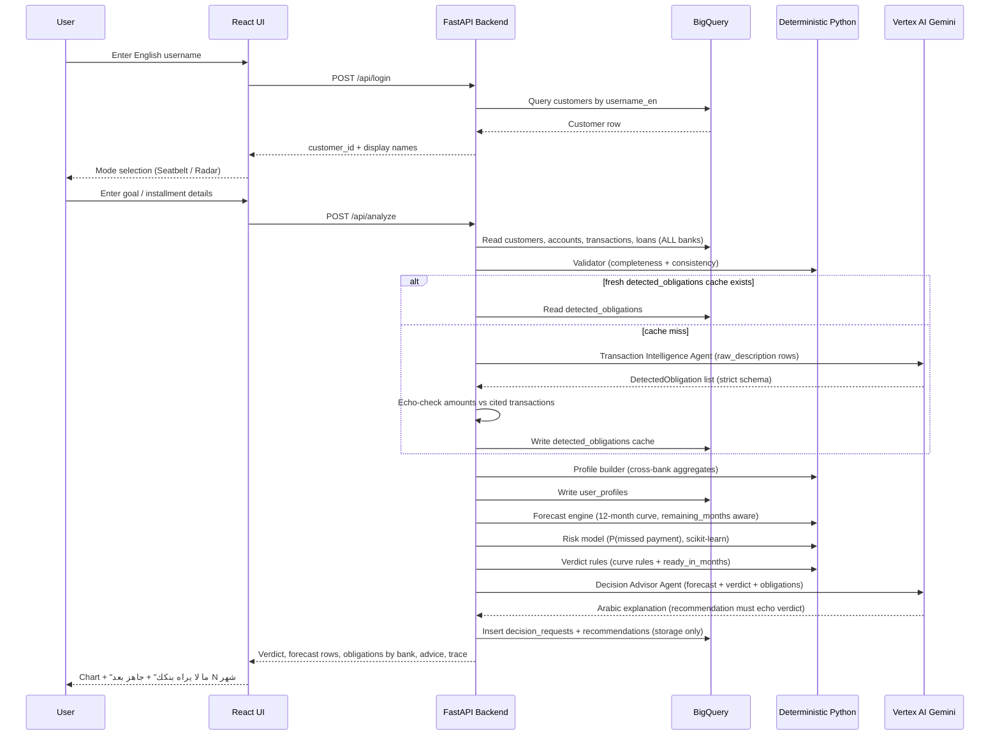
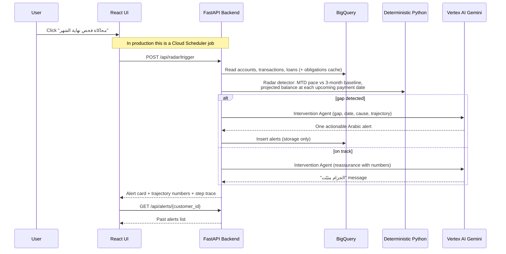

## 2. User Workflow

### Mode A — Decision Seatbelt

```mermaid
sequenceDiagram
    participant U as User
    participant UI as React UI
    participant API as FastAPI Backend
    participant BQ as BigQuery
    participant Det as Deterministic Python
    participant Gemini as Vertex AI Gemini

    U->>UI: Enter English username
    UI->>API: POST /api/login
    API->>BQ: Query customers by username_en
    BQ-->>API: Customer row
    API-->>UI: customer_id + display names
    UI-->>U: Mode selection (Seatbelt / Radar)

    U->>UI: Enter goal / installment details
    UI->>API: POST /api/analyze

    API->>BQ: Read customers, accounts, transactions, loans (ALL banks)
    API->>Det: Validator (completeness + consistency)

    alt fresh detected_obligations cache exists
        API->>BQ: Read detected_obligations
    else cache miss
        API->>Gemini: Transaction Intelligence Agent (raw_description rows)
        Gemini-->>API: DetectedObligation list (strict schema)
        API->>API: Echo-check amounts vs cited transactions
        API->>BQ: Write detected_obligations cache
    end

    API->>Det: Profile builder (cross-bank aggregates)
    API->>BQ: Write user_profiles
    API->>Det: Forecast engine (12-month curve, remaining_months aware)
    API->>Det: Risk model (P(missed payment), scikit-learn)
    API->>Det: Verdict rules (curve rules + ready_in_months)

    API->>Gemini: Decision Advisor Agent (forecast + verdict + obligations)
    Gemini-->>API: Arabic explanation (recommendation must echo verdict)

    API->>BQ: Insert decision_requests + recommendations (storage only)
    API-->>UI: Verdict, forecast rows, obligations by bank, advice, trace
    UI-->>U: Chart + "ما لا يراه بنكك" + جاهز بعد N شهر
```

### Mode B — Financial Radar

```mermaid
sequenceDiagram
    participant U as User
    participant UI as React UI
    participant API as FastAPI Backend
    participant BQ as BigQuery
    participant Det as Deterministic Python
    participant Gemini as Vertex AI Gemini

    U->>UI: Click "محاكاة فحص نهاية الشهر"
    Note over UI,API: In production this is a Cloud Scheduler job
    UI->>API: POST /api/radar/trigger

    API->>BQ: Read accounts, transactions, loans (+ obligations cache)
    API->>Det: Radar detector: MTD pace vs 3-month baseline,<br/>projected balance at each upcoming payment date

    alt gap detected
        API->>Gemini: Intervention Agent (gap, date, cause, trajectory)
        Gemini-->>API: One actionable Arabic alert
        API->>BQ: Insert alerts (storage only)
    else on track
        API->>Gemini: Intervention Agent (reassurance with numbers)
        Gemini-->>API: "الحزام مثبّت" message
    end

    API-->>UI: Alert card + trajectory numbers + step trace
    UI->>API: GET /api/alerts/{customer_id}
    API-->>UI: Past alerts list
```
