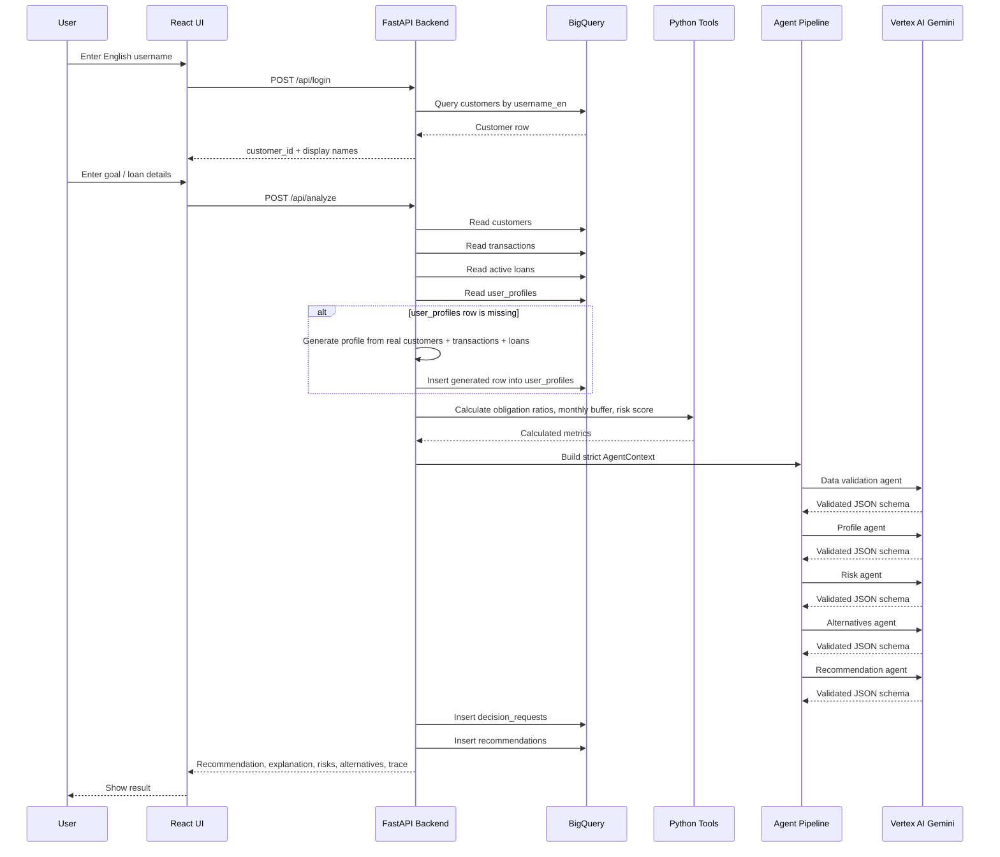

## 2. User Workflow

```mermaid
sequenceDiagram
    participant U as User
    participant UI as React UI
    participant API as FastAPI Backend
    participant BQ as BigQuery
    participant Tools as Python Tools
    participant Agents as Agent Pipeline
    participant Gemini as Vertex AI Gemini

    U->>UI: Enter English username
    UI->>API: POST /api/login
    API->>BQ: Query customers by username_en
    BQ-->>API: Customer row
    API-->>UI: customer_id + display names

    U->>UI: Enter goal / loan details
    UI->>API: POST /api/analyze

    API->>BQ: Read customers
    API->>BQ: Read transactions
    API->>BQ: Read active loans
    API->>BQ: Read user_profiles

    alt user_profiles row is missing
        API->>API: Generate profile from real customers + transactions + loans
        API->>BQ: Insert generated row into user_profiles
    end

    API->>Tools: Calculate obligation ratios, monthly buffer, risk score
    Tools-->>API: Calculated metrics

    API->>Agents: Build strict AgentContext
    Agents->>Gemini: Data validation agent
    Gemini-->>Agents: Validated JSON schema
    Agents->>Gemini: Profile agent
    Gemini-->>Agents: Validated JSON schema
    Agents->>Gemini: Risk agent
    Gemini-->>Agents: Validated JSON schema
    Agents->>Gemini: Alternatives agent
    Gemini-->>Agents: Validated JSON schema
    Agents->>Gemini: Recommendation agent
    Gemini-->>Agents: Validated JSON schema

    API->>BQ: Insert decision_requests
    API->>BQ: Insert recommendations
    API-->>UI: Recommendation, explanation, risks, alternatives, trace
    UI-->>U: Show result
```
